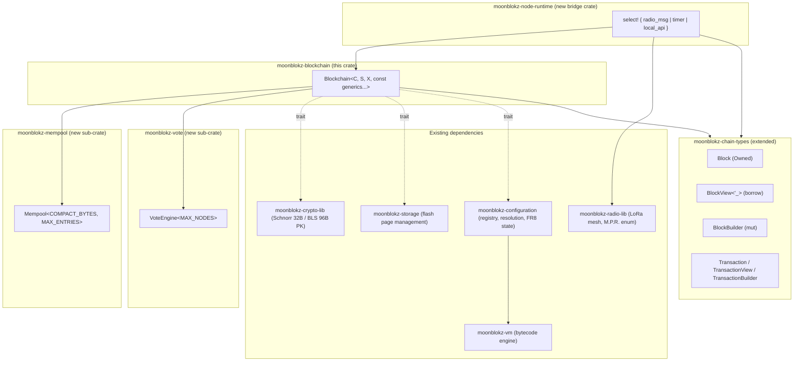
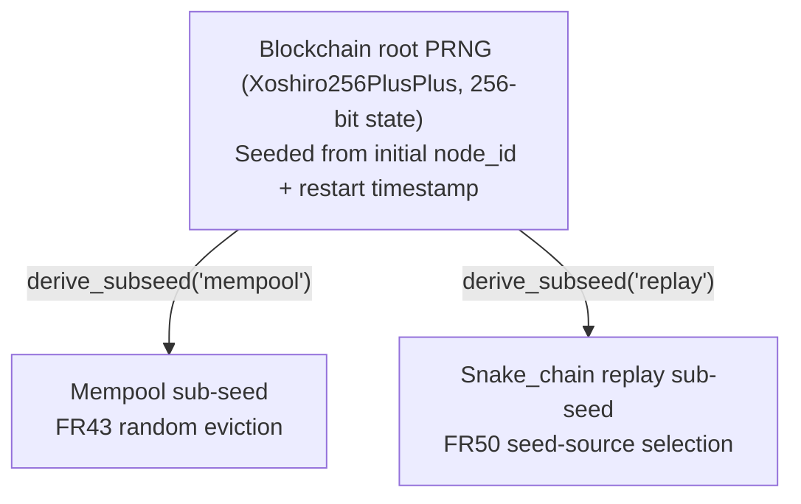
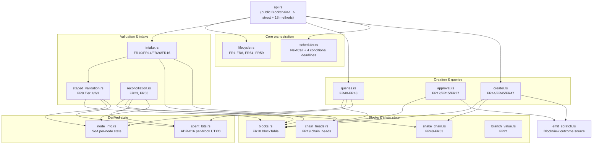

# MoonBlokz Blockchain Architecture Decision Document

## Authoritative Source Notice

This document is the **authoritative source** for the architecture of the `moonblokz-blockchain` crate and its sibling sub-crates (`moonblokz-mempool`, `moonblokz-vote`, `moonblokz-node-runtime`, and the future `moonblokz-configuration`).

When other knowledge-base files (concept, algorithm, implementation, ADR) describe data structures, module boundaries, public API surfaces, RAM/stack budgets, the const-generic catalog, or the crate-split layout, the canonical wording lives in this file. If any other knowledge-base text appears to diverge from the content here, the divergence must be flagged explicitly per the rule in [`AGENTS.md`](./AGENTS.md), and resolution must be left to the user.

The behavioral requirements (FR1–FR69) remain anchored in [`moonblokz-blockchain-prd.md`](./moonblokz-blockchain-prd.md); this architecture document specifies how those requirements are realized in code shape.

## Provenance

- Originating workflow: BMAD `bmad-create-architecture`, eight steps completed (Steps 1–8) between 2026-05-19 and 2026-06-17.
- Source artifact: `_bmad-output/planning-artifacts/architecture.md`.
- Imported into the `moonblokz-info` knowledge base on 2026-06-17.
- Frontmatter from the originating workflow output was stripped during import; the body below is otherwise byte-identical to the source artifact at import time.

## Working Artifacts (Iteration History)

The step-by-step iteration HTML outputs are preserved at the repository root and provide the full Mermaid diagrams, bit-level data layout tables, and intermediate reasoning across the architecture work:

- `step5-architecture.html` — crate-split architecture, mempool/vote API, PRNG hierarchy, sequence diagrams (FR14, FR45, FR23, FR43).
- `step6-architecture.html` — internal module structure (15 + 1 modules), const generic catalog, sized data structure catalog, RAM budget, stack-frame analysis.
- `step7-architecture.html` — FR1–FR69 coverage matrix, gap analysis, RAM-budget verification, FR62 simulator-compatibility check.

These HTMLs are the iteration history; this `moonblokz-blockchain-architecture.md` is the consolidated normative reference.

## Related Knowledge-Base Documents

- [`moonblokz-blockchain-prd.md`](./moonblokz-blockchain-prd.md) — authoritative FR1–FR69 functional requirements and NFR1–NFR26 Non-Functional Requirements that this architecture realizes.
- [`moonblokz-blockchain-concept.md`](./moonblokz-blockchain-concept.md) — operating-model background and conceptual framing.
- [`moonblokz-blockchain-algorythm.md`](./moonblokz-blockchain-algorythm.md) — formal algorithm description that this architecture implements.
- [`moonblokz-blockchain-implementation.md`](./moonblokz-blockchain-implementation.md) — supplementary engineering cautions, source-article bridging notes, and items deferred to later design work. This document defers to `moonblokz-blockchain-architecture.md` for all data-structure, module-boundary, public API, and RAM/stack-budget specifics.
- [`blockchain-adrs/ADR-INDEX.md`](./blockchain-adrs/ADR-INDEX.md) — architecture decisions consumed by this architecture document.

---

## Architecture Decision Document — `moonblokz-blockchain` and Related Crates

_Workflow: BMAD `bmad-create-architecture`. Steps 1-8 complete (2026-05-19 → 2026-06-17). Step-by-step working artifacts preserved at `step5-architecture.html`, `step6-architecture.html`, `step7-architecture.html`._

## Workflow Inputs Summary

**Project:** moonblokz — `moonblokz-blockchain` Rust crate as the authoritative blockchain interpretation boundary under constrained embedded and radio-network conditions.

**Source PRD frontmatter:** `projectType: developer_tool`, `domain: fintech`, `complexity: high`, `projectContext: greenfield`.

**Authoritative knowledge base:** `moonblokz-info/` (per WORKING-ARTIFACTS-MAP, this is the integrated KB; `_bmad-output/adr-drafts/separate/` are older drafts and are superseded). The KB contains 16 accepted ADRs covering 6 subsystems: blockchain, crypto, radio, storage, simulator, telemetry.

**Anchoring constraints carried in from inputs:**
- Constrained embedded environment (microcontroller-class, RP2040-grade), bounded memory and storage
- Best-effort, low-bandwidth radio network with delayed/partial/conflicting block delivery
- No global time assumptions
- Snake-chain bounded retention; chain switches are rare but mandatory
- Single-threaded, synchronous, deterministic core (ADR-006)
- Same crate semantics for runtime AND simulator embedding (host + embedded)
- Compile-time backend selection across crypto / storage / radio backends
- Out-of-band telemetry (logs, commands, OTA) must NOT distort the LoRa mesh
- Bounded aggregation: `MAX_AGGREGATED_SIGNATURES = 50` (Schnorr default); affects approval subgroup sizing per ADR-015

**Subsystem boundary picture (from KB):**
- `moonblokz-blockchain` (this crate) — semantic event state machine, owns chain truth
- `moonblokz-crypto-lib` — replaceable signature backends (Schnorr default, BLS alt)
- `moonblokz-radio-lib` — bounded best-effort LoRa propagation with stateful relay
- `moonblokz-storage` + `moonblokz-chain-types` — narrow indexed persistence contract
- `moonblokz-radio-simulator` — multi-mode desktop tool reusing the real radio + blockchain libs
- Telemetry stack (Probe, HUB, Collector, CLI, Update Server) — out-of-band ops surface

---

## 1. Framework & Hard Constraints (Steps 1-4)

### 1.1 User-declared hard constraints

The architecture work was reframed from the BMAD default deliverables (generic technology choices, scalable patterns, service diagrams) to a focused set of 4 deliverables driven by the constrained-embedded reality:

- **`no_std` Rust without `alloc`** — every collection must be fixed-capacity (heapless / arrays / const-generic). No `Box`, `Vec`, `String`, `BTreeMap`.
- **Already-given dependencies** that the crate must consume, not reinvent: `moonblokz-crypto-lib`, `moonblokz-storage`, `moonblokz-chain-types`, `moonblokz-radio-lib`. All `no_std`, already shipping.
- **Target: RP2040-LoRa.** When sized properly, the binding constraint is **RAM**, not flash or CPU (264 KB SRAM, shared with crypto buffers, radio queues, storage page buffer, Embassy task stacks).
- **Fully synchronous core** — the public API exposes only synchronous methods callable from radio task / local API / timer handler. The radio crate owns the async runtime; the blockchain crate is pure functions.

### 1.2 Architecture deliverables (4 items)

1. **Public API definition** (sync, narrow) — see §2.
2. **In-memory data structure budget** — sized for ~600 durable blocks (RP2040 figure: 2 MB flash − code − control plane ÷ 4 KB page × 2 slots/page) and up to ~1000 nodes — see §3 + §4.
3. **Internal module structure** — see §5.
4. **Vote management and mempool extracted into separate library crates** alongside `moonblokz-blockchain` — see §2.

### 1.3 The single-outcome scheduling-pull API pattern

Every state-changing call returns **at most ONE outcome** (one semantic effect: one outbound, one classification, one phase transition) and a `NextCall` deadline (`Immediate` / `At(absolute_monotonic_ms)` / `Idle`) telling the bridge layer when to call back.

If the blockchain has more work pending (e.g., a queued parent-recovery request after relaying a block), it returns `NextCall::Immediate` and emits the second outcome on the next call. Read-only queries do **not** change scheduling and do **not** carry a `NextCall`.

**Why:**
1. Radio outgoing queue overflow prevention — many FRs specify required delays between protocol actions; one-outcome-per-call lets the blockchain self-regulate its outbound rate naturally.
2. Simpler API surface — no `BoundedOutboundList`, no batch-drain helpers, no list-of-effects enum variants.
3. Bridge layer simplicity — the bridge's `embassy::select` loop only needs one `Timer::at(next_due)` arm.

### 1.4 Bridge layer = `moonblokz-node-runtime`

The radio↔blockchain integration lives in a **separate bridge crate** (`moonblokz-node-runtime`), not inside the blockchain. The bridge owns the embassy async runtime and handles:
- Translating `RadioMessage` enum variants (from `moonblokz-radio-lib`) into blockchain semantic calls (`receive_block`, `receive_transaction`, `receive_support`).
- Translating outcome variants back into radio outgoing messages via `MessageProcessingResult` (radio crate's existing enum, FR66).
- Scheduling: a single `embassy::select` loop with one `Timer::at(NextCall)` arm.
- Two-core split: Core 0 hosts real-time radio + local-UI tasks; Core 1 hosts the blockchain task **including the `moonblokz-blockchain` crate, the `moonblokz-mempool` sub-crate, the `moonblokz-vote` sub-crate, and the `moonblokz-configuration` sub-crate** — all sync, no-alloc state lives on Core 1. Embassy channels bridge cores.

### 1.5 Local clock assumption

Across the mesh, no shared epoch is assumed, but local clocks tick at **approximately the same rate**. All FR-defined timing (block-creation intervals, grace-period windows, parent-recovery retries) operates on local monotonic `u64` ms. This assumption is required for all timing-driven protocols to converge.

---

## 2. Crate-split architecture (Step 5)

### 2.1 Final crate structure



**New crates introduced by this architecture:**
1. `moonblokz-mempool` — extracted from blockchain per FR30 (mempool is separate module)
2. `moonblokz-vote` — extracted as its own concern (vote engine is separate from the radio-side scoring module per PRD FR55)
3. `moonblokz-node-runtime` — bridge layer, hosts embassy async + radio↔blockchain glue
4. `moonblokz-configuration` — holds chain-config state, the shared parameter registry, the code-baked defaults, and content acceptance per FR7 / FR8 / FR17 / FR49 / FR56
5. `moonblokz-vm` — the bytecode execution engine the configuration crate drives for computed parameters (FR56 mini-VM); a self-contained crate with no MoonBlokz domain concepts, so the post-MVP smart-contract runtime can build on it

Both are specified in [Configuration Module Specification](./moonblokz-configuration-specification.md) and are `no_std`, no-alloc, and free of `embassy` / `alloc` — the dependency-graph gate that keeps `moonblokz-blockchain` host-testable without an async runtime applies transitively to both.

**Extensions to existing crates:**
- `moonblokz-chain-types` — adds the three-type model (Owned / View / Builder) per FR61 and the Step 5 refactor
- `moonblokz-radio-lib` — getter API additions to expose radio-derived score input cleanly to vote crate (per the `scoring_module` boundary in PRD FR55)

### 2.2 Three-type model (Owned + View + Builder)

For every wire-format payload (Block, Transaction, Support, … ) `moonblokz-chain-types` exposes:

| Type | Purpose | Lifetime | Size |
|---|---|---|---|
| `Block` (Owned) | Returned by storage reads; passes through hot paths by value (NRVO-friendly) | `'static` | ~2 KB on stack |
| `BlockView<'_>` | Borrow into existing bytes (radio buffer / emit scratch / storage page) | bound to source | ~16 B (pointer + len) |
| `BlockBuilder` | Mutation surface for block construction (FR45 creator) | scope of construction | ~2 KB internal buffer |

Outcomes use `BlockView<'_>` to keep enum variants small (~16 B borrow), not 2 KB owned. The `emit_scratch.block_buffer` in blockchain state owns the bytes; the view borrows them.

### 2.3 PRNG sub-seed derivation hierarchy (FR43)



The mempool sub-crate receives a sub-seed during initialization; the blockchain retains the root (the vote sub-crate is fully deterministic and takes no sub-seed). This ensures deterministic, reproducible PRNG behavior across the system without coupling the sub-crates to each other.

**Algorithm choice (2026-06-27 revision).** The original Step 4 framing named WyRand u64 as the root PRNG. The 2026-06-27 implementation pass (Story 1.3) substituted Xoshiro256PlusPlus (Blackman & Vigna, 2018, via the `rand_xoshiro` crate) for the same root + sub-seed-derivation role. The substitution is contained: it does not change the public `derive_subseed(label) -> u64` contract or the sub-crate integration (each sub-crate still receives an opaque `u64` and chooses its own internal PRNG). Rationale: significantly higher statistical quality (PractRand >2 TB vs. ~32 GB) at negligible cost on RP2040 (+24 B per instance, comparable cycle budget per `next_u64`, no new transitive deps beyond `rand_xoshiro` + `rand_core`, both `no_std` with `default-features = false`).

**Vote sub-seed removal (2026-07-04 revision).** The hierarchy originally derived a third sub-seed, `derive_subseed('vote')`, reserved for FR38 creator ordering (AR11). Story 3.3 shipped FR38 fully deterministic (descending accumulated vote, ascending node-id tie-break), ADR-015's approval-subgroup seed is content-derived (`H(snake_chain_tail_hash ‖ proposer_node_id ‖ proposed_sequence)`) inside the blockchain crate, and Epics 8–9 introduce no non-deterministic path — no planned story consumes vote-side randomness. The vote sub-seed, `VoteEngine::new`'s `sub_seed` parameter, and the engine's stored PRNG were removed; `moonblokz-vote` no longer depends on `rand_xoshiro`.

### 2.4 Sequence diagrams (illustrative)

The full Step 5 HTML contains 4 sequence diagrams for FR14 (transaction intake), FR45 (block creation), FR23 (chain-switch), FR43 (mempool replenishment). All four are preserved at `step5-architecture.html` §2.

---

## 3. Public API (Step 5)

### 3.1 `Blockchain<C, S, X, ...>` struct + 20 public methods

```rust
pub struct Blockchain<
    C: CryptoTrait,
    S: StorageTrait,
    X: ChainConfigTrait,
    const MAX_NODES: usize,                  // 1000
    const SNAKE_CHAIN_LENGTH_MAX: usize,     // 500 — capacity; the active W is chain-config
    const VERIFICATION_HORIZON: usize,       // 20
    const MAX_BLOCKS: usize,                 // 600
    const MAX_BRANCH_COUNT: usize,           // 40
    const MAX_BLOCK_UTXO_OUTPUT: usize,      // 256
    // ... PUBLIC_KEY_SIZE, SIGNATURE_SIZE derived from crypto feature
> { /* see §4 for fields */ }

impl<...> Blockchain<...> {
    // === Lifecycle / init — see §3.6 ===

    /// Single in-place constructor for **every** node (genesis, join, and
    /// restart alike). Writes a fresh `Blockchain` through `dst` and starts in
    /// `Collecting`. The by-value-return form was removed for the embedded
    /// stack budget; construction always goes through this in-place write.
    /// `node_zero_public_key` is the out-of-band firmware trust anchor
    /// (decision rows 1 / 20); for node #0 it is node #0's own key.
    pub unsafe fn init_in_place(
        dst: *mut Self,
        crypto: C, storage: S, chain_config: X,
        local_node_id: u32,
        node_zero_public_key: [u8; PUBLIC_KEY_SIZE],
        prng_seed: u64,
    );

    /// FR54 — node-#0 genesis bootstrap, run as a plain `&mut self` method on an
    /// already-`init_in_place`d instance (not a constructor). Builds BOTH genesis
    /// blocks in a single call — Block #0 (own registration + initial
    /// self-transfer for `initial_total_network_currency`) and Block #1
    /// (chain-config carrying `initial_chain_config_bytes`, `previous_hash`
    /// chained to Block #0) — persists both, and returns both so the caller
    /// broadcasts them over the radio, lowest-sequence first. Refused with
    /// `GenesisRejectReason::StorageNotEmpty` on a non-empty (already
    /// bootstrapped) chain, or `LocalNodeIdNotZero` off node #0.
    ///
    /// Genesis is a one-per-chain bootstrap with no immediately-scheduled
    /// follow-up work, so — unlike the recurring methods — it carries **no
    /// `NextCall`** (a plain `Result`, not a `CallResult`) and takes **no `now`**.
    /// It sits deliberately outside the AR4 single-outcome scheduling-pull
    /// contract; normal scheduling resumes with the caller's regular `on_tick`.
    pub fn process_genesis(
        &mut self,
        initial_total_network_currency: u64,
        initial_chain_config_bytes: &[u8],
    ) -> Result<GenesisBlocks, GenesisRejectReason>;

    // ⚠️ INCONSISTENCY TO RECONCILE (flagged per governance; resolution left to
    // the maintainer): with genesis now `init_in_place` + `process_genesis`, the
    // single-constructor model supersedes the "three separate `initialize_*`
    // constructors" of decision row 18. The `initialize_join` / restart surfaces
    // below still describe the old constructor shape; they should be reframed as
    // `init_in_place` + a role-specific follow-up (join: mesh intake; restart:
    // an FR59 storage-load method) once that redesign is decided.

    /// Initialize as a new node joining an existing network.
    /// Starts in `Collecting` phase; chain truth is acquired from the mesh.
    /// `own_node_id` is provisional until FR6 registration is accepted.
    pub fn initialize_join(
        own_node_id: u32,
        node_zero_pk: &[u8],
        crypto: C, storage: S, chain_config: X,
        prng_seed: u64,
        now: u64,
    ) -> CallResult<InitJoinOutcome>;

    /// FR59 — Restart from durable storage after a power cycle.
    /// Reads `own_node_id` from storage; `node_zero_pk` is caller-supplied
    /// from code (the out-of-band firmware trust anchor that identifies the
    /// chain, per decision rows 1 / 20), never read from storage — corrupted
    /// storage therefore cannot forge it. Then enters collecting state
    /// unconditionally: it rebuilds the block-tree from the retained blocks
    /// and, once the FR2 stopping conditions hold, runs the FR3 processing
    /// pass through to ready. No lifecycle-state marker is persisted; any
    /// prior in-flight processing state is discarded.
    pub fn initialize_from_storage(
        node_zero_pk: &[u8],
        crypto: C, storage: S, chain_config: X,
        prng_seed: u64,
        now: u64,
    ) -> CallResult<InitRestartOutcome>;

    // === Intake (state-changing) (4) ===
    pub fn receive_block(&mut self, block: BlockView<'_>, now: u64)
        -> CallResult<ReceiveBlockOutcome>;
    pub fn receive_transaction(&mut self, tx: TransactionView<'_>, now: u64)
        -> CallResult<ReceiveTransactionOutcome>;
    pub fn receive_support(&mut self, s: SupportView<'_>, now: u64)
        -> CallResult<ReceiveSupportOutcome>;
    pub fn submit_local_transaction(&mut self, tx: TransactionView<'_>, now: u64)
        -> CallResult<ReceiveTransactionOutcome>;

    // === Tick (1) ===
    pub fn on_tick(&mut self, now: u64) -> CallResult<TickOutcome>;

    // === Read-only (12) — no NextCall ===
    pub fn serve_block_by_hash(&self, hash: &[u8; 32]) -> Option<BlockView<'_>>;
    pub fn serve_block_by_sequence(&self, seq: u32) -> Option<BlockView<'_>>;
    pub fn serve_transaction_by_hash(&self, hash: &[u8; 32]) -> Option<TransactionView<'_>>;
    pub fn query_balance(&self, node_id: u32) -> u64;
    pub fn query_top_mempool_items(&self) -> impl Iterator<Item = TransactionView<'_>> + '_;
    pub fn is_block_known(&self, hash: &[u8; 32]) -> bool;
    pub fn is_transaction_known(&self, hash: &[u8; 32]) -> bool;
    pub fn current_phase(&self) -> LifecyclePhase;
    pub fn current_active_head(&self) -> Option<u32>;
    pub fn snake_chain_tail_sequence(&self) -> Option<u32>;
    // ... + 2 introspection getters (feature-gated, see §3.5)
}
```

### 3.2 Outcome enums (single-outcome pattern)

Every state-changing method returns `CallResult<OutcomeEnum>` where `CallResult<T> = (T, NextCall)`. Each outcome enum has at most ONE variant active per call:

```rust
pub enum NextCall {
    Immediate,            // call back ASAP — pending internal work
    At(u64),              // absolute monotonic ms
    Idle,                 // nothing scheduled
}

pub enum ReceiveBlockOutcome<'a> {
    DuplicateKnown,                                                   // FR11
    Rejected(RejectReason),                                           // FR9 tier failure
    AcceptedSilently,                                                 // FR16 storage-only
    AcceptedAndSendBlock(BlockView<'a>),                              // FR26 relay (Epic 8)
    AcceptedAndSendSupport(SupportView<'a>),                          // FR12 deviance support (Epic 6)
    // FR19 parent-recovery is NOT a ReceiveBlockOutcome (revised 2026-07-12,
    // Story 4.4): it is scheduler-driven, not a reaction to the just-received
    // block — it is emitted from on_tick as TickOutcome::SendParentRecoveryRequest,
    // gated by the FR46 global cooldown, and the receiving block only schedules
    // the tick (NextCall::At). Keeping it off receive_block also avoids the radio
    // immediately relaying + emitting a recovery request in the same receive step
    // (send-side contention). The relay/support variants above ARE receive-driven
    // and correctly stay here.
    // ... one per FR-defined effect, exactly one variant per call
}

// Similar for ReceiveTransactionOutcome, ReceiveSupportOutcome, InitOutcome.
// TickOutcome carries the scheduler-driven effects, e.g.
// SendParentRecoveryRequest(ParentRecoveryRequest) (FR19, Story 4.4).
// (Genesis Block #1 is no longer a tick effect — both genesis blocks are
// produced by `process_genesis`; see §3.6 and decision row 19.)
```

### 3.3 Mempool sub-crate API (10 method-groups)

```rust
pub struct Mempool<
    const COMPACT_BYTES: usize,    // 20160
    const MAX_ENTRIES: usize,      // 128
> { /* compact_buffer + index + sub-seed PRNG */ }

impl<...> Mempool<...> {
    pub fn new(sub_seed: u64, own_node_id: u32) -> Self;
    pub fn try_add(&mut self, tx: TransactionView<'_>, transaction_fee: u64, is_deferred: bool) -> AddResult;
    pub fn get_by_hash(&self, hash: &[u8; 32]) -> Option<TransactionView<'_>>;
    pub fn contains(&self, hash: &[u8; 32]) -> bool;
    pub fn confirm_by_block_acceptance(&mut self, accepted: &BlockView<'_>);
    pub fn recheck_eligibility(&mut self, balance_check: impl Fn(u32) -> u64);
    pub fn eligible_iter(&self) -> impl Iterator<Item = TransactionView<'_>> + '_;
    pub fn top_n_for_exchange(&self, n: usize) -> impl Iterator<Item = (TransactionView<'_>, u64)> + '_;
    pub fn entry_count(&self) -> u8;
    pub fn capacity_pressure(&self) -> CapacityPressure;

    // Feature-gated introspection (FR65 #[cfg(feature = "introspection")])
    #[cfg(feature = "introspection")]
    pub fn current_capacity_bytes(&self) -> u16;
    #[cfg(feature = "introspection")]
    pub fn max_capacity_bytes(&self) -> u16;
}
```

### 3.4 Vote sub-crate API

```rust
pub enum VoteEngineError {
    AccumulatedVoteOverflow,
    AccumulatedVoteUnderflow,
    UnreachableInterestState,
}

pub struct VoteEngine<const MAX_NODES: usize> {
    accumulated_vote: [u32; MAX_NODES],      // 4 KB on 1000-node default
    vote_scale: NonZeroU16,                  // one vote credit and interest cap
    vote_interest: u8,                       // anti-capture growth numerator
    cap_threshold: u32,                      // derived, not serialized
}

impl<const MAX_NODES: usize> VoteEngine<MAX_NODES> {
    pub fn new(vote_scale: NonZeroU16, vote_interest: u8) -> Self;
    pub fn apply_block(&mut self, block: BlockView<'_>) -> Result<(), VoteEngineError>; // FR37 forward
    pub fn undo_block(&mut self, block: BlockView<'_>) -> Result<(), VoteEngineError>;  // FR23 backward
    pub fn seed_from_balance_block(&mut self, block: BlockView<'_>);      // FR50 seed source
    pub fn top_creator(&self) -> Option<u32>;                             // FR38 top of creator order
    pub fn creator_at_rank(&self, rank: usize) -> Option<u32>;            // FR38 / FR44 fallback order
    pub fn is_creator_within_rank(&self, rank: usize, node_id: u32) -> bool; // FR44 band membership (rank = band size; 1 = top)
    pub fn accumulated_vote_of(&self, node_id: u32) -> u32;               // accumulated_vote raw
}
```

**Query-surface revision (2026-07-04).** `top_creator` originally carried `(deadline_seq: u32, now: u64)` parameters reserved for Epic 8 grace-period progression; they were removed. Deadline handling is the blockchain module's concern (`scheduler.rs` / `creator.rs`, FR44–FR47): it queries `top_creator()` on every block and walks `creator_at_rank(rank)` as the grace-period admitted set expands. The vote crate stays a pure, time-independent projection over accumulated votes. The expected frequent Epic 8 call is `is_creator_within_rank(rank, node_id)` — a single O(MAX_NODES) early-exit membership test for the top-`rank` band (`rank` is the band size; `1` = top creator). Zero-vote nodes are ranked too — they form the ascending-id tail of the order — so the all-zero bootstrap state yields node 0 as top creator and `top_creator()` returns `None` only for the degenerate `MAX_NODES == 0` (2026-07-04). The single-slot top-creator cache was removed (2026-07-04): `top_creator()` is a pure uncached O(MAX_NODES) `&self` scan — block cadence is slow enough that caching a ~1000-element scan is not worth the interior-mutability (`Cell`) surface and its invalidation discipline. Hence no `cached_top_creator` field.

### 3.5 Introspection (FR65)

The introspection getters (`current_capacity_bytes`, `max_capacity_bytes`, similar mempool/vote/blocks accessors) are **feature-gated** behind `#[cfg(feature = "introspection")]`. Default build excludes them. The simulator + telemetry CLI enable the feature for observability; production firmware excludes them to minimize binary size.

### 3.6 Three init methods — genesis / join / restart

Construction is a single infallible in-place constructor, `init_in_place`, used by **every** node regardless of boot mode. The role-specific bootstrap then runs as a follow-up on the constructed instance. For node #0 that follow-up is the genesis bootstrap `process_genesis` (below). Join and restart are still described here in their earlier three-constructor form pending the reconciliation flagged in §3.1 (they should likewise become `init_in_place` + a role-specific follow-up).

| Boot mode | Construction + bootstrap | Precondition | Phase after |
|---|---|---|---|
| Genesis (node #0) | `init_in_place(...)` then `process_genesis(...)` — creates Blocks #0 **and** #1 in the one `process_genesis` call | Chain is empty; caller holds the node-zero key | `Ready` — node #0 authored a complete chain, so no FR2 acquisition / FR3 reconstruction is needed (join/restart still pass through `Collecting`) |
| Join | `initialize_join(...)` *(to be reframed as `init_in_place` + mesh intake)* | Storage is empty; `node_zero_pk` known a priori (trust anchor) | `Collecting` |
| Restart | `initialize_from_storage(...)` *(to be reframed as `init_in_place` + an FR59 storage-load)* | Storage non-empty; `node_zero_pk` supplied from code (trust anchor); no lifecycle phase persisted | `Collecting` (→ `Processing` → `Ready` once FR2 holds) |

**Genesis two-block bootstrap** (per `moonblokz-info` Part IV) — both blocks are built in the single `process_genesis` call and returned together so the bridge broadcasts both, lowest-sequence first:
- **Block #0** — transaction block: node #0's own registration + an initial self-transfer of `initial_total_network_currency`.
- **Block #1** — chain-config block: encodes `initial_chain_config_bytes`; its `previous_hash` chains to Block #0 and it is signed over its full canonical content. It is **not** emitted from a later `on_tick` — that split (former decision row 19) is superseded.

Besides persisting both blocks, `process_genesis` mirrors them into the in-memory block-tree as node #0's active chain (both `on_active_chain`, Block #1 the active head, one `chain_heads` entry) so the tree stays consistent with storage, and sets the lifecycle phase directly to **`Ready`**. Genesis blocks are valid by construction and bypass the tier1 intake gate. Walking-skeleton scope: the full `Stored`→`Active` status promotion (Epic 6) and the FR3 derived projections — roster, balances, etc. (Epic 7) — still land later, so `Ready` here is at the chain-structure level.

```rust
// Plain product of the two success blocks — NOT a single-outcome enum:
// refusal is carried by the `Err(GenesisRejectReason)` half of the Result,
// so there is no `Rejected` variant here.
pub struct GenesisBlocks {
    pub block_zero: Block,                             // broadcast both,
    pub block_one: Block,                              // lowest sequence first
}

pub enum InitJoinOutcome {
    StartedCollecting,                                 // phase = Collecting; await mesh blocks
    Rejected(JoinRejectReason),
}

pub enum InitRestartOutcome {
    ResumedProcessing,                                 // needs FR3 forward traversal first
    ResumedReady,                                      // already in Ready
    Rejected(RestartRejectReason),                     // storage corruption, etc.
}

// TickOutcome — no genesis variant: both genesis blocks come from
// `process_genesis`, not from a tick (see decision row 19).
pub enum TickOutcome<'a> {
    // ... existing variants
    Idle,                                              // no time-driven behavior fired
    SendParentRecoveryRequest(ParentRecoveryRequest),  // FR19 — Story 4.4 (scheduler-driven)
}
```

**Why separate bootstrap paths, not one mode enum:**
- Different precondition contracts (empty vs. populated chain vs. specifically node-zero) are clearer as separate entry points than as one `initialize(mode, ...)`.
- Different parameter shapes — genesis needs `initial_total_network_currency` + `initial_chain_config_bytes`; join/restart don't.
- Different outcome types reflect distinct effect spaces.
- The bridge layer is structured around the boot-mode decision anyway (a CLI flag or stored-state probe); a single method would just push the dispatch one level deeper.

Note (post-genesis-redesign): construction itself is now unified in the single `init_in_place`; the boot-mode distinctions above are realized as follow-ups on the constructed instance (genesis = `process_genesis`), not as separate constructors.

**Init parameter rationale (fixed decisions):**

| # | Question | Decision | Rationale |
|---|---|---|---|
| 1 | Should `node_zero_pk` be a parameter to every init method? | **Yes** — in all 3 init methods | Code-level bootstrap-of-trust protection: during stored-chain validation, `node_zero_pk` must come from an out-of-band trusted source (for example, baked into firmware); otherwise corrupted storage could provide a false trust anchor. |
| 2 | Entropy-source trait or simple `prng_seed: u64`? | **`prng_seed: u64`** | The bridge layer is responsible for producing a meaningful seed (RP2040 ROSC jitter, `own_node_id × restart_count` hash, etc.). The blockchain simply accepts the `u64`. |
| 3 | Should `own_node_id` be a parameter to the genesis bootstrap? | **Implicit 0** — `process_genesis` requires the instance's `local_node_id == 0` (else `LocalNodeIdNotZero`), rather than taking a separate id | The genesis context is by definition “I am node #0”. The trust anchor (`node_zero_public_key`) is supplied once at `init_in_place`. |
| 4 | What is the state of `chain_config: X` at genesis? | **Empty-state implementor**; `initial_chain_config_bytes` is retained during `process_genesis` and emitted as Block #1 in the same call | The `chain_config` becomes authoritative content when Block #1 is built. Durable-lock semantics land in Story 5.6. |
| 5 | `storage: S` preconditions in the 3 cases | genesis: **empty**; join: **empty**; restart: **non-empty + well-formed** | The init method returns a `Rejected` outcome if the precondition is not met; it does not panic. |

---

## 4. Internal module structure (Step 6 §1, §4)

### 4.1 15 internal modules + `api.rs`



### 4.2 Module-by-module summary

The full per-module breakdown (processes / data structures / relationships / API) is in `step6-architecture.html` §4. Brief summary:

| Module | Primary FR | Owns / mutates |
|---|---|---|
| `lifecycle.rs` | FR1-FR8, FR54, FR59 | `lifecycle_phase: LifecyclePhase` (1 B on Blockchain) |
| `scheduler.rs` | FR46 | `SchedulerState` (~72 B) |
| `blocks.rs` | FR18 | `BlockTable { blocks: [BlockEntry; 600] }` (45.6 KB) |
| `chain_heads.rs` | FR19 | `ChainHeadsTable { heads: [ChainHeadEntry; 40] }` (2.88 KB — Story 4.4, §6.3) |
| `snake_chain.rs` | FR48-FR53 | 2 u32 fields on Blockchain (8 B) |
| `branch_value.rs` | FR21 | (stateless; operates on `ChainHeadEntry.branch_value`) |
| `intake.rs` | FR10/FR14/FR16/FR26 | (stateless dispatcher) |
| `staged_validation.rs` | FR9 | (stateless tier 1/2/3 checks) |
| `reconciliation.rs` | FR23, FR58 | (stateless backward/forward walk) |
| `node_info.rs` | FR6, FR50, FR67/FR69 | 4 parallel arrays SoA (~44 KB Schnorr / ~108 KB BLS) |
| `spent_bits.rs` | ADR-016, FR3, FR51 | (operates on `BlockEntry.spent_bits` co-located) |
| `creator.rs` | FR44/FR45/FR47 | (stateless; uses `bc.crypto.sign`) |
| `approval.rs` | FR12/FR15/FR27 | `ApprovalAccumulator` (~2 KB, crypto-agnostic — MAX_BLOCK_SIZE buffer) |
| `queries.rs` | FR40-FR43 | (stateless) |
| `emit_scratch.rs` | (FR45/FR27 emit source) | `EmitScratch { block_buffer: [u8; MAX_BLOCK_SIZE] }` (~2 KB) |

---

## 5. Const generic catalog (Step 6 §2)

| Const generic | Default | Source / rationale |
|---|---|---|
| `MAX_NODES` | 1000 | user-set; **network-wide registered-node cap** — sizes all node-id-indexed arrays (`NodeInfo.public_keys`/`balances`/`seed_source_idx`, `VoteEngine.accumulated_vote`). Every node in the network holds an entry for every other registered node. See §12.1 for tuning trade-offs. |
| `SNAKE_CHAIN_LENGTH_MAX` | 500 | user-set; **capacity** of the active-chain window. The window length actually in force, `W`, is chain configuration (FR56) and must satisfy `W ≤ SNAKE_CHAIN_LENGTH_MAX`, checked at chain-config acceptance per FR8. A node whose capacity is below the chain's `W` cannot participate; above it, the node uses only the first `W` entries. Same capacity-versus-requirement pattern as `UTXO_UNSPENT_BITS` and `max_block_UTXO_output`. |
| `VERIFICATION_HORIZON` (H) | 20 | user-set; FR58 cheap-zone boundary |
| `MAX_BLOCKS` | 600 | RP2040 flash storage capacity 1:1 |
| `MAX_BRANCH_COUNT` (chain_heads_max_capacity) | 40 | collecting-state branch headroom |
| `MEMPOOL_COMPACT_BYTES` | 20160 | ~10 × MAX_BLOCK_SIZE |
| `MEMPOOL_MAX_ENTRIES` | 128 | conservative |
| `MAX_TX_PER_BLOCK` | ~64 | derived; FR45 included_keys gathering |
| `MAX_BLOCK_UTXO_OUTPUT` | 256 | FR56 chain-config-derived; per-block spent-bit vector size |
| `MAX_AGGREGATED_SIGNATURES` | 50 | ADR-015; approval subgroup sizing |
| `PUBLIC_KEY_SIZE` | 32 (Schnorr) / 96 (BLS) | crypto feature flag |
| `SIGNATURE_SIZE` | derived from crypto feature | varies |

---

## 6. Sized data structure catalog (Step 6 §3)

### 6.1 `NodeInfo` — node-roster SoA state

Each parallel array is indexed by **global node-id** and sized to `MAX_NODES` — the network-wide registered-node cap. Every node maintains an entry for every other registered node, because the consensus model and balance reconstruction require full roster knowledge (per [`moonblokz-blockchain-concept.md`](./moonblokz-blockchain-concept.md) and §12.1).

```rust
pub(crate) struct NodeInfo<const MAX_NODES: usize, const PUBLIC_KEY_SIZE: usize> {
    public_keys:       [[u8; PUBLIC_KEY_SIZE]; MAX_NODES],  // 32 KB Schnorr / 96 KB BLS
    balances:          [u64; MAX_NODES],                    // 8 KB
    seed_source_idx:   [u32; MAX_NODES],                    // 4 KB  FR50 per-node projection
    max_known_node_id: u32,                                 // 4 B
}
```

Empty slot sentinel: `public_keys[i] == [0u8; PUBLIC_KEY_SIZE]` (FR67/FR69 trust anchor occupies slot 0 — non-zero).

### 6.2 `BlockEntry` — in-memory block metadata

```rust
pub(crate) struct BlockEntry {
    hash: [u8; 32],                                // 32 B   FR11 duplicate-detection key
    parent_ref: u32,                               //  4 B   index into blocks (u32::MAX = no parent)
    sequence: u32,                                 //  4 B   FR21/FR19 tie-break (u32::MAX = empty slot)
    spent_bits: [u8; SPENT_BITS_BYTES],            // 32 B   ADR-016 co-located (see revision note)
    head_ref_count: u8,                            //  1 B   FR19 eviction
    flags: u8,                                     //  1 B   is_on_active_chain (bit 0) + status (bits 1-2, Stored/Connected/Active) + payload_type (bits 3-4)
    len: u16,                                      //  2 B   exact serialized length (FR6 byte-exact checks; fills the former tail padding)
}
// effective 76 B, aligned to 4 → 76 B; total 600 × 76 B = 45 600 B
```

**Key decisions** (Step 6):
- No `storage_index` field — `blocks[i] ⟷ storage_index = i` 1:1 mapping
- Spent-bits **co-located** in BlockEntry per ADR-016 (no separate `SpentBitTable`)
- `flags` bits 3-4 cache the block's `payload_type` as `payload_type - 1`, so the FR3 backward mark can locate the candidate segment's earliest balance block — the `max_known_node_id` existence-floor seed source of FR6's referenced-node-existence check — without one storage read per marked block (free: previously-unused flag bits)
- `len` records the exact serialized length at intake because durable backends read blocks back zero-padded to a fixed slot; the FR6 byte-exact checks trim to it first (not recoverable across restart — see the Story-5.7 length-recovery decision)
- Empty slot sentinel: `sequence == u32::MAX` (FR53 rejects u32::MAX-based chain extension in MVP)
- Side-branch blocks have spent_bits = all zeros (~3 KB harmless waste, absorbed by Schnorr margin)

**Story 4.1 revision (2026-07-04).** Three clarifications from implementation, none changing the 76 B / 45 600 B budget above:
- `spent_bits` is a fixed `SPENT_BITS_BYTES = 32` constant, not the generic expression `MAX_BLOCK_UTXO_OUTPUT / 8` shown in earlier drafts — sizing an array from a divided const-generic parameter requires the unstable `generic_const_exprs` feature, which this workspace does not enable (the same constraint already documented for `moonblokz-crypto-lib`'s fixed-size array API). The byte count is unchanged (256 / 8 = 32 at the architecture §5 default); Epic 7 resolves the generic-sizing question if `MAX_BLOCK_UTXO_OUTPUT` ever needs to vary per deployment.
- `flags` bit assignment is now specified: bit 0 = `is_on_active_chain` (live in Story 4.1); bits 1-2 are reserved for Story 4.2's FR9 status value (`Stored`/`Connected`/`Active`) — Story 4.1 reserves the bits but does not define the enum or its transition map; bits 3-7 are unused.
- The FR18 chain-head arrival timestamp is **not** a `BlockEntry` field. FR18's actual requirement is "at least for every chain head block," and `BlockEntry`'s table has 600 entries at the default profile — adding a `u64` there would widen every entry to 88 B padded (+7.2 KB total), which is immaterial against the Schnorr backend's ~67-77 KB SRAM margin (§7.3) but eats meaningfully into the BLS backend's already-tight ~7-17 KB margin. `chain_heads.rs`'s `ChainHeadEntry` (§6.3, Story 4.4) has only 40 entries — the same field there costs ~320 B. Story 4.4 adds the arrival timestamp to `ChainHeadEntry` instead.

### 6.3 `ChainHeadEntry` — FR19 chain_heads table

```rust
pub(crate) struct ChainHeadEntry {
    head_idx: u32,                  //  4 B   index into blocks (u32::MAX = empty slot)
    tail_or_connection_idx: u32,    //  4 B   Stored → tail-point; Connected/Active → connection-point
    missing_parent_hash: [u8; 32],  // 32 B   Stored-only: tail-point's previous_hash (Story 4.4)
    last_request_timestamp: u64,    //  8 B   FR19 parent-recovery scheduling
    arrival_timestamp: u64,         //  8 B   FR18 head-scoped arrival time (Story 4.4; Epic 8 consumer)
    branch_value: u64,              //  8 B   FR21 cumulative (Connected/Active only)
    flags: u8,                      //  1 B   state (bit 0 = connected; Active derived globally)
}
// effective 65 B, aligned to 8 → padded 72 B; total 40 × 72 B = 2 880 B
```

**Key decisions:**
- `head_idx: u32` (not 32 B hash) → saves 1.1 KB vs. hash storage
- No `head_sequence` cache → resolved via `blocks[head_idx].sequence` (single deref, padding makes the cache free-of-charge anyway)
- `tail_or_connection_idx` overlaid (state-dependent semantics) → saves 480 B
- Empty slot sentinel: `head_idx == u32::MAX`
- No per-head Active flag — active membership is derived globally (`head_idx == active_chain_head_idx`, §6.4).

**Story 4.4 revision (2026-07-12, ratified).** `arrival_timestamp: u64` (the FR18 head-scoped arrival timestamp Story 4.1 deferred here — populated but read by Epic 8 for FR9 Tier 3 block-creation pacing, never a tie-break input) and `missing_parent_hash: [u8; 32]` (a Stored-only cache of the tail-point's `previous_hash`, so the parent-recovery scheduler and mutation event (ii) need no durable-storage read) were added and accepted, taking the entry from 25 B / 1 280 B to 65 B effective / 72 B padded (2 880 B, +1 600 B — trivial against the Schnorr ~67-77 KB margin).

### 6.4 Snake_chain fields (directly on Blockchain)

```rust
// Blockchain struct fields:
active_chain_head_idx: u32,    // 4 B   index into blocks
snake_chain_tail_idx:  u32,    // 4 B   index into blocks (W blocks behind head)
```

No standalone struct — only 2 u32 fields. `snake_chain.rs` module remains as operations container.

### 6.5 `ApprovalAccumulator` — FR27 proposer-mode evidence

```rust
pub(crate) struct ApprovalAccumulator {
    // Evidence block in-place builder. Buffer capacity = MAX_BLOCK_SIZE;
    // no additional supporters fit beyond this, regardless of crypto backend.
    // Crypto-agnostic: ~2 KB on both Schnorr and BLS.
    block_buffer: [u8; MAX_BLOCK_SIZE],          // ~2 KB
    block_len: u16,
    deviation_sequence: u32,
    deviation_block_hash: [u8; 32],
    accumulated_count: u8,
}
// total: ~2 KB + ~40 B metadata = ~2 KB
```

**Crypto-aware per-supporter cost within the 2 KB buffer:**
- **Schnorr**: each new supporter adds `node_id` (4 B) + signature (~32 B) ≈ **36 B / supporter** → 50 supporters ≈ 1.8 KB (near the 2 KB limit).
- **BLS**: each new supporter adds only `node_id` (4 B); the signature lives in a single 96 B aggregated-signature slot, which does not grow with supporter count. ≈ **4 B / supporter** → 50 supporters ≈ 296 B (ample room).

Here BLS is significantly **more efficient** than Schnorr: the same 2 KB buffer can hold 5–10× more supporters. The allocated memory remains unchanged at ~2 KB for both variants.

### 6.6 `EmitScratch` — outcome view source

```rust
pub(crate) struct EmitScratch {
    block_buffer: [u8; MAX_BLOCK_SIZE],   // ~2 KB
    block_len: usize,
}
```

Outcome enum variants (`CreatedBlock`, `AcceptedAndSendBlock`, FR27 evidence) borrow `BlockView<'_>` from this buffer → outcome size ~16 B, not 2 KB owned. Transaction outcomes borrow from the mempool compact buffer (no separate `emit_tx_buffer`).

### 6.7 `SchedulerState` — 4 conditional deadlines

```rust
pub(crate) struct SchedulerState {
    next_block_creation_deadline_ms:    Option<u64>,  // FR45 (b) — network-wide-consistent
    next_grace_period_expiry_ms:        Option<u64>,  // FR47 — network-wide-consistent
    next_parent_recovery_tick_ms:       Option<u64>,  // FR19/FR46 — local
    next_replenishment_tick_ms:         Option<u64>,  // FR43/FR46 — local
    last_parent_request_emit_timestamp: u64,
}
// ~72 B
```

**Critical invariant:** `next_block_creation_deadline_ms` and `next_grace_period_expiry_ms` are **computed identically on all nodes** from chain-config-derived params + previous block arrival timestamp — both deadlines are typically `Some` simultaneously on every node in ready state. Trigger action differs by local role (creator vs. fallback eligibility), but deadline state is network-wide-consistent. The other two deadlines are local-state-dependent.

### 6.8 Mempool internals (recap)

```rust
pub struct Mempool<const COMPACT_BYTES: usize, const MAX_ENTRIES: usize> {
    compact_buffer: [u8; COMPACT_BYTES],                // 20 160 B default
    index: [Option<IndexEntry>; MAX_ENTRIES],           // 128 × ~24-32 B ≈ ~3-4 KB straightforward layout
    prng: Xoshiro256PlusPlus,                            // 32 B inner state (seeded from 8 B u64 sub-seed)
    byte_usage: u16,
    entry_count: u8,
    own_node_id: u32,                                    // local owner classification input for FR33
}
// total ~23-25 KB at the default profile before any later index bit-packing
```

`IndexEntry` is private mempool storage metadata, not public API. It carries the FR30 storage fields (`start`, `length`, `hash_crc32`, `transaction_fee`) plus support fields for deferred eligibility, local own/non-own classification, and byte-local window-expiry metadata. `hash_crc32` is IEEE CRC32 over the canonical transaction hash; lookup uses it only as a prefilter before full-hash verification, while FR43 replenishment uses it as the compact exclusion identifier. `transaction_fee` is the already-resolved fee supplied by the blockchain validation path at mempool admission, avoiding repeated UTXO block lookups during priority iteration and block assembly. There is no getter/accessor surface for this internal struct; module-local code and unit tests use direct field access to keep the embedded API surface small. `expiry_sequence` is `NodeTransfer.anchor_sequence`, the minimum complex balance-input `anchor_sequence`, or `u32::MAX` when no byte-local sequence dependency is available (registration, UTXO-only complex, zero-input complex). UTXO-input expiry that depends on the referenced output's containing block sequence requires blockchain / UTXO-cache context rather than a byte-local index field. The FR33 ownership class is local: node-transfer and registration transactions are own when their initializer equals `own_node_id`; complex transactions are own when they have at least one input and either a balance input initializer or a balance output receiver equals `own_node_id`; UTXO-only and zero-input complex transactions are non-own. The current compact-buffer implementation constrains `COMPACT_BYTES` to `u16` offsets and `MAX_ENTRIES` to `u8` entry counts. `MAX_NODES` is intentionally not a mempool const generic: node-roster capacity belongs to `Blockchain` / `NodeInfo` and `VoteEngine`, while the mempool only needs the local `own_node_id` value to classify incoming transactions.

### 6.9 Vote engine internals (recap)

```rust
pub struct VoteEngine<const MAX_NODES: usize> {
    accumulated_vote: [u32; MAX_NODES],     // 4 KB
    vote_scale: NonZeroU16,                 // 2 B
    vote_interest: u8,                      // 1 B
    cap_threshold: u32,                     // 4 B derived threshold
}
// total ~4 KB plus a few scalar config fields
```

---

## 7. RAM budget verification (Steps 6 §4 + 7 §3)

### 7.1 Chain-lib subtotal — Schnorr (default) — ~95 KB

| Component | Calculation | Bytes |
|---|---:|---:|
| NodeInfo.public_keys | 1000 × 32 B | 32 000 |
| NodeInfo.balances | 1000 × 8 B | 8 000 |
| NodeInfo.seed_source_idx | 1000 × 4 B | 4 000 |
| NodeInfo.max_known_node_id | 4 B | 4 |
| BlockTable | 600 × 76 B | 45 600 |
| ChainHeadsTable | 40 × 72 B | 2 880 |
| snake_chain fields | 2 × 4 B | 8 |
| ApprovalAccumulator | MAX_BLOCK_SIZE buffer (crypto-agnostic) | ~2 048 |
| EmitScratch.block_buffer | MAX_BLOCK_SIZE | ~2 000 |
| lifecycle_phase | u8 | 1 |
| SchedulerState | 4 × Option\<u64\> + u64 | 72 |
| PRNG root | u64 | 8 |
| **Subtotal (Schnorr)** | | **~95 021** |

### 7.2 Chain-lib subtotal — BLS — ~159 KB

| Component | Calculation | Bytes |
|---|---:|---:|
| NodeInfo.public_keys | 1000 × 96 B | 96 000 |
| NodeInfo.balances + seed_source_idx + max_known | 12 004 | 12 004 |
| BlockTable | 600 × 76 B | 45 600 |
| ChainHeadsTable | 40 × 72 B | 2 880 |
| snake_chain fields | 8 | 8 |
| ApprovalAccumulator | MAX_BLOCK_SIZE buffer (crypto-agnostic) | ~2 048 |
| EmitScratch + lifecycle + scheduler + PRNG | ~2 081 | 2 081 |
| **Subtotal (BLS)** | | **~159 021** |

**Note:** Earlier Step 7 validation incorrectly assumed BLS ApprovalAccumulator was ~6 KB (per-supporter signature × MAX_AGGREGATED_SIGNATURES). The correct model is: ApprovalAccumulator holds a fixed MAX_BLOCK_SIZE buffer (~2 KB) for in-place evidence-block construction. BLS aggregation packs more supporters into the same buffer (~4 B per supporter) than Schnorr (~36 B per supporter), so BLS is actually *more efficient* per supporter — but the allocated memory is identical.

### 7.3 264 KB SRAM full allocation

| Consumer | Schnorr | BLS |
|---|---:|---:|
| moonblokz-blockchain + mempool + vote | ~122 KB | ~186 KB |
| moonblokz-radio-lib (memory-config-medium) | ~60 KB | ~60 KB |
| moonblokz-crypto-lib scratch | ~4 KB | ~4 KB |
| moonblokz-storage page buffer | ~4 KB | ~4 KB |
| Embassy task stacks (5-6 tasks × 4-6 KB) | ~24 KB | ~24 KB |
| Embassy executor + statics | ~4 KB | ~4 KB |
| **Subtotal allocated** | **~218 KB** | **~282 KB** |
| **Margin** (264 KB − allocated) | **~46 KB** (~17%) ✅ | **~−18 KB** (exceeds 264 KB) ❌ |

**Radio figure:** `memory-config-medium` is counted at its source-confirmed ~60 KB (`moonblokz-radio-lib` README + `lib.rs` profile consts); an earlier ~30-40 KB estimate under-counted it and made the BLS default appear feasible.

### 7.4 Verdict

- **Schnorr build**: comfortable margin, MVP-ready.
- **BLS build**: does **not** fit at the 1000-node default once the radio `memory-config-medium` profile is counted at its source-confirmed ~60 KB (README + `lib.rs`) instead of the earlier ~30-40 KB estimate — the full-system total is ~282 KB, ~18 KB over the 264 KB ceiling. Const-generic tuning (see §12) is therefore **mandatory** for BLS: `MAX_NODES 1000 → 500` frees ~56 KB, yielding ~39 KB margin.

---

## 8. Stack frame analysis (Steps 6 §5 + 7 §4)

| Scenario | Call depth | Peak | Note |
|---|---|---:|---|
| (1) `receive_block` hash-already-known | api → intake → blocks.find_by_hash | ~250 B | Tier 1 fast-path |
| (2) `receive_block` Tier 3 validation | api → intake → staged_validation → reconciliation | ~1.5 KB | local view refs |
| (3) **FR45 block creation** | on_tick → creator.try_create_block → BlockBuilder (~2 KB) → bc.crypto.sign → emit_scratch | **~4 KB** | BlockBuilder is the hot spot |
| (4) FR23 chain-switch backward walk | reconciliation loop { storage.read_block (~2 KB) → undo } | ~2.2 KB | one Block on stack per iter |
| (5) FR23 forward walk peak | reconciliation forward → mempool.recheck_eligibility | ~3 KB | accumulated locals |
| (6) FR59 restart | lifecycle.restart_from_storage → reconciliation.reconstruct loop | ~3 KB | same iter pattern as FR23 |

**Decision:** the `moonblokz-node-runtime` bridge layer must declare the blockchain hosting embassy task with a **6 KB stack** (not the 4 KB default). Other embassy tasks (radio, USB console) can remain 4 KB.

---

## 9. FR-coverage validation (Step 7 §1, §2)

### 9.1 Summary

| Status | Count | FRs |
|---|---:|---|
| ✓ Hard-covered | **63** | FR1-FR6, FR9-FR16, FR18-FR48, FR50, FR51, FR53-FR55, FR57-FR67, FR68, FR69 |
| →ext External crate | **5** | FR7, FR8, FR17, FR49, FR56 (all chain-config — `moonblokz-configuration`) |
| MVP skip | **1** | FR52 (no explicit UTXO saturation detection — design decision) |
| Gap | **0** | — |

### 9.2 Selected coverage highlights

- **FR9 Tier 1/2/3** → `staged_validation.rs` with crypto handle through `bc.crypto.verify`
- **FR19 chain_heads** → `chain_heads.rs` + `scheduler.next_parent_recovery_tick_ms`
- **FR23 chain-switch** → `reconciliation.reconcile_to_new_head` (backward + forward walk)
- **FR45 block creation** → `creator.try_create_block` (`bc.crypto.sign` inside blockchain)
- **FR50 balance replay coverage** → `node_info.seed_source_idx` per-node SoA projection
- **FR62 simulator compat** → no_std + no_alloc + sync core (see §10)
- **FR65 no_std public API** → entire crate stack is `#![no_std]`
- **FR68 no local signing key** → blockchain holds `CryptoTrait` handle, never raw key bytes; sign happens inside blockchain via `bc.crypto.sign(...)`

The full FR1-FR69 coverage matrix (per-FR row with primary + support modules) is in `step7-architecture.html` §1.1-1.8.

### 9.3 FR52 — explicit MVP-skip rationale

FR52 ("no explicit UTXO saturation detection") is itself a "doing nothing" requirement: MVP has no admission control / backpressure on the UTXO space. The snake_chain bounded retention (FR48) + spent-bit vector (ADR-016) + `MAX_BLOCK_UTXO_OUTPUT = 256` per-block limit already cap memory growth. Direct admission control is post-MVP.

---

## 10. FR62 simulator compatibility (Step 7 §5)

The blockchain design is **fully compatible** with the existing `moonblokz-radio-simulator` (std host, multi-node, eframe/egui-based desktop tool):

| Requirement | Step 5/6 design | Status |
|---|---|---|
| `no_std` | All three new crates (`moonblokz-blockchain`, `moonblokz-mempool`, `moonblokz-vote`) are `#![no_std]` | ✓ |
| Runs on std host | no_std crates compile on std targets if no `alloc` dependency | ✓ |
| No `'static` requirement | Sync API + owned `Blockchain` instance — no `'static` queues, no globals | ✓ |
| Multiple parallel instances | Const-generic + owned struct — independent `Blockchain::<...>::init_in_place(...)` (via a local `MaybeUninit`) per simulated node | ✓ |
| No alloc dependency | heapless / array / const-generic everywhere | ✓ |
| External crates (crypto, storage) trait-based | Simulator can supply mock implementations | ✓ |
| Deterministic sync execution | Sync API + monotonic `now: u64` input → replay-friendly (FR63) | ✓ |
| Compile-time backend variability | Const-generic params + crypto feature flag | ✓ |

**Integration sketch** (post-Step 8, not in scope for this architecture):

```rust
// moonblokz-radio-simulator (std host)
struct SimNode {
    blockchain: Blockchain<MockCrypto, MockStorage, MockChainConfig, MAX_NODES_SIM, ...>,
    mempool:    Mempool<...>,
    vote:       VoteEngine<MAX_NODES_SIM>,
}

async fn node_task(mut node: SimNode, mut rx: Receiver<Event>) {
    loop {
        match select(rx.next(), Timer::at(next_due)).await {
            Either::First(ev) => handle_outcome(node.blockchain.receive_block(ev.view(), now), &mut node).await,
            Either::Second(_) => handle_outcome(node.blockchain.on_tick(now), &mut node).await,
        }
    }
}
```

**Critical**: the blockchain never requires `'static` queues, so no `Box::leak()` is needed on the blockchain state (the simulator already uses `Box::leak()` for radio queues — that's a radio-lib requirement, not a blockchain one).

---

## 11. `ChainConfigTrait` surface

The 5 delegated FRs (FR7, FR8, FR17, FR49, FR56) live in the separate `moonblokz-configuration` crate, which drives `moonblokz-vm` for computed parameters. Both crates are specified in [Configuration Module Specification](./moonblokz-configuration-specification.md); that specification is authoritative for the wire format, the shared parameter registry, the VM execution model, and the acceptance rules. This section records only the surface the blockchain sees.

**Availability model.** Parameter accessors are not reached directly on the trait. The module yields an **optional active-configuration handle** — present when a configuration is loaded (tentative per FR8, or durable per FR54 / FR8), absent otherwise — and the accessors live on that handle, where each one always returns a value: resolution falls through chain-config override, code-baked default, and a code-baked fallback literal that terminates the chain. The handle also carries the tentative-vs-durable commitment state, so a value and the commitment state that produced it cannot be read from two different points in time. The handle **borrows** the module, which makes FR56's no-caching rule structural: it cannot outlive the invocation that acquired it, and it cannot be held across a mutation of the configuration state.

```rust
pub trait ChainConfigTrait {
    fn active_configuration(&self) -> Option<ActiveConfig<'_>>;

    // FR8 tentative/durable state operations (the lifecycle that drives them
    // stays in the blockchain; the state lives here). `payload` is the whole
    // chain-config block payload — content region plus FR7 content signature —
    // so the module derives the content boundary from the same envelope walk
    // the blockchain's Tier-1 check used.
    fn load_tentative(&mut self, payload: &[u8]) -> Result<(), ChainConfigError>;
    fn load_durable(&mut self, payload: &[u8]) -> Result<(), ChainConfigError>;
    fn promote_durable(&mut self) -> Result<(), ChainConfigError>;   // set-once
    fn discard_tentative(&mut self);
    fn tentative_content(&self) -> Option<&[u8]>;   // FR8 byte-identity compare
    fn durable_content(&self) -> Option<&[u8]>;     // FR17 commitment key
    fn is_durable_locked(&self) -> bool;
}

impl ActiveConfig<'_> {
    pub fn commitment(&self) -> Commitment;                        // Tentative | Durable
    pub fn inter_block_interval_ms(&self) -> u32;                  // FR45 (b), ms
    pub fn grace_period_window_ms(&self) -> u32;                   // FR47, ms
    pub fn block_size_limit(&self) -> u16;
    pub fn max_utxo_outputs(&self) -> u8;
    pub fn max_aggregated_signatures(&self) -> u8;
    pub fn registration_price(&self, registered_nodes: u32) -> u64;
    // ... one accessor per registry entry; arity per the registry
}
```

Three items from the earlier sketch are deliberately absent. FR7 signature validation is **not** on this trait: FR7 / FR69 make the content-signature check a state-free Tier-1 `CryptoTrait` check against the code-level trust anchor, which must run irrespective of configuration state. `initial_total_network_currency` is **not** a chain-config parameter at all — FR56 excludes it, and it is fixed by block #0 at genesis. And there is no `try_propose_change` governance path: configuration is locked for the lifetime of the chain, and no runtime change mechanism exists.

**Why a trait, not direct ownership in blockchain:**
- The configuration crate carries the FR56 mini-VM through `moonblokz-vm` — a domain-specific capability that does not belong in the core blockchain logic, and the substrate for the post-MVP smart-contract system.
- The blockchain must remain `no_std` no-alloc and minimal; keeping VM execution in separate crates keeps the blockchain lean.
- Trait-based decoupling lets the simulator and tests inject mock chain-configs trivially.

**Owned by Blockchain via generic param:** `X: ChainConfigTrait` (see §3.1 Blockchain struct definition). The blockchain calls `bc.chain_config.active_configuration()` and reads the parameters it needs from the returned handle, within the invocation that needs them.

**Consumers outside the blockchain.** The configuration content also carries parameters consumed by other subsystems — today the radio runtime-tuning parameters. They do not travel through the blockchain: the configuration module calls a mandatory generic `ConfigChangeSink` on every state transition, and the node runtime implements that sink, builds the radio snapshot from the handle's accessors, and publishes it over an `embassy_sync::watch::Watch`. The transport stays on the firmware side so that `embassy-sync` never enters the configuration crate's dependency graph, and the blockchain's single-outcome scheduling-pull contract is untouched.

---

## 12. BLS deployment-tuning recipe (Step 8 — new)

When a deployment selects the BLS crypto backend, the default const-generic values (1000 nodes, 500 snake-chain window) **do not fit** the 264 KB SRAM ceiling once the radio `memory-config-medium` profile is counted at its source-confirmed ~60 KB (full-system ~282 KB, ~18 KB over). The blockchain code does NOT need to change — tuning happens at the deployment binary's const-generic instantiation site, and for BLS it is mandatory rather than optional.

### 12.1 Tuning levers (most impactful first)

| Lever | Default → Tuned | RAM saved | Functional impact |
|---|---|---:|---|
| `MAX_NODES` | 1000 → 500 | −56 KB | Halves node-roster capacity. Network size cap. |
| `MAX_NODES` | 1000 → 250 | −84 KB | Quarter capacity. Suitable for small deployments. |
| `SNAKE_CHAIN_LENGTH_MAX` | 500 → 300 | −6.4 KB (spent-bits) | Caps the chain `W` this build can join; deeper-zone events more frequent. |
| `MAX_BRANCH_COUNT` | 40 → 20 | −640 B | Less branch headroom; collecting-state may need quicker convergence. |
| `MAX_AGGREGATED_SIGNATURES` | 50 → 30 | **Schnorr: −0.7 KB** in ApprovalAccumulator. **BLS: ~0 KB** (signature is single aggregated slot, only `supporter_node_ids` shrinks). Per ADR-015, must verify subgroup robustness. |
| `MEMPOOL_COMPACT_BYTES` | 20160 → 12000 | −8 KB | Smaller mempool capacity; more frequent replenishment. |

**Note:** `MAX_AGGREGATED_SIGNATURES` tuning saves more on Schnorr than on BLS, because Schnorr accumulates per-supporter signatures (~32 B each) while BLS aggregates them into a single 96 B slot. BLS deployments should prefer `MAX_NODES` or `MEMPOOL_COMPACT_BYTES` tuning instead.

### 12.2 Recommended BLS deployment profiles

| Profile | MAX_NODES | SNAKE_CHAIN | Margin (BLS, 264 KB) |
|---|---:|---:|---:|
| BLS-large | 1000 | 500 | ~−18 KB (default — does NOT fit) ❌ |
| BLS-medium | 500 | 500 | ~39 KB ✅ |
| BLS-small | 250 | 300 | ~73 KB ✅ |

### 12.3 Future optimization (NOT MVP)

A future architectural enhancement: **LRU public key cache**. Hot nodes' public keys stay in a small RAM cache (e.g. 100-200 slots = ~10-20 KB BLS), cold nodes only hold a reference to the block where the key lives. Storage read on cache miss. Could save ~70-80 KB on BLS deployments. Tracked as a follow-up, not in MVP.

---

## 13. Refactor / implementation task list (Step 8 — finalized)

Tasks to bring the empty `moonblokz-blockchain` directory and the existing dependencies in line with this architecture:

| # | Task | Crate / location | Notes |
|---|---|---|---|
| 1 | Establish empty `moonblokz-blockchain/` directory for the new crate | filesystem | Greenfield scaffold; the new crate lives in its own directory. |
| 2 | Scaffold `moonblokz-mempool/` crate (new sibling) | filesystem | See §3.3 API surface. |
| 3 | Scaffold `moonblokz-vote/` crate (new sibling) | filesystem | See §3.4 API surface. |
| 4 | Scaffold `moonblokz-node-runtime/` bridge crate | filesystem | embassy::select loop + radio↔blockchain glue. |
| 5 | Add three-type model to `moonblokz-chain-types` | existing crate | `Block` (Owned) + `BlockView<'_>` + `BlockBuilder` per FR61. Also Transaction triplet. |
| 6 | Rename `Block` → `BlockView` where applicable in chain-types | existing crate | Per Step 5 user directive: current `Block` is actually a view. |
| 7 | Radio-lib getter API additions | `moonblokz-radio-lib` | Expose radio-derived score input cleanly for vote sub-crate (per PRD FR55 `scoring_module` boundary). |
| 8 | Set `moonblokz-node-runtime` blockchain task stack to 6 KB | `moonblokz-node-runtime/src/main.rs` | Per §8 stack analysis. Other tasks remain 4 KB. |
| 9 | Initial scaffold for `moonblokz-configuration` crate | filesystem (placeholder) | Trait stub per §11 only; full BMAD later. |
| 10 | Wire all 4 new crates into `moonblokz-node/Cargo.toml` | existing | Add `moonblokz-blockchain` + `moonblokz-mempool` + `moonblokz-vote` + `moonblokz-node-runtime` path deps. |

---

## 14. Decisions log (consolidated)

Selected high-impact decisions from the Step 5 + Step 6 + Step 7 iterations:

| # | Decision | Rationale |
|---|---|---|
| 1 | Single-outcome scheduling-pull API pattern | Radio queue overflow prevention; FR-defined delays self-rate-limit |
| 2 | Bridge layer as separate `moonblokz-node-runtime` crate | Embassy runtime ownership separation; blockchain stays sync no_std |
| 3 | Three-type model (Owned / View / Builder) for Block + Transaction | Outcome enums stay ~16 B (borrow) not 2 KB (owned) |
| 4 | Mempool + vote extracted into separate sub-crates | FR30 + FR55 (`scoring_module` boundary); clean concern separation |
| 5 | Const-generic Blockchain\<C, S, X, MAX_NODES, ...\> | Compile-time configuration without alloc |
| 6 | Crypto handle stored on Blockchain, sign happens inside blockchain | FR68 — blockchain holds trait handle, never raw key bytes |
| 7 | BlockEntry array of structs (AoS) with co-located spent_bits | ADR-016 alignment; lifecycle coupling; ~3 KB harmless side-branch waste |
| 8 | No `storage_index` field in BlockEntry | `blocks[i] ⟷ storage_index = i` 1:1 |
| 9 | `head_idx == u32::MAX` / `sequence == u32::MAX` as empty-slot sentinels | Saves count field; FR53 already rejects u32::MAX-based chain extension |
| 10 | `tail_or_connection_idx` overlaid in ChainHeadEntry | State-dependent semantics; saves 480 B / 40 entries |
| 11 | NodeInfo SoA layout | Saves ~4 KB padding vs. AoS; consistent with vote crate |
| 12 | Lifecycle phase as 1-byte field directly on Blockchain | No separate LifecycleState struct (single field doesn't justify it) |
| 13 | SchedulerState 4 conditional deadlines as `Option<u64>` | FR46 explicit "not scheduled" states; `filter_map(min)` for NextCall |
| 14 | Block-creation + grace-period deadlines network-wide-consistent | Critical consensus invariant; both `Some` on every node, role-differentiated triggers |
| 15 | `moonblokz-configuration` (+ `moonblokz-vm`) as separate crates | FR56 mini-VM capability doesn't belong in core blockchain; designed in the [Configuration Module Specification](./moonblokz-configuration-specification.md) |
| 16 | Chain-lib hosting embassy task gets 6 KB stack (not 4 KB) | §8 FR45 block creation peak ~4 KB |
| 17 | Feature-gated introspection getters (`#[cfg(feature = "introspection")]`) | FR65 production binary minimal; simulator/CLI enable for observability |
| 18 | ~~Three separate `initialize_*` constructors (genesis / join / restart)~~ **Superseded:** a single in-place constructor `init_in_place` for every node + role-specific follow-ups (genesis = `process_genesis`). Distinct precondition contracts remain, now as follow-ups rather than constructors. Join/restart reframing still pending (see §3.1 flag). |
| 19 | ~~Genesis two-block bootstrap split across `initialize_genesis` + next `on_tick`~~ **Superseded:** `process_genesis` builds **both** Block #0 and Block #1 in one call and returns both for radio broadcast; there is no `GenesisChainConfigCreated` tick effect. New reject reason `GenesisRejectReason::StorageNotEmpty` guards re-genesis of a non-empty chain. The return is a plain `Result<GenesisBlocks, GenesisRejectReason>` — a bare `GenesisBlocks { block_zero, block_one }` struct (no `Rejected` variant; refusal is the `Err`) and **no `NextCall`/`now`**: genesis is one-per-chain with no immediately-scheduled follow-up, so it is kept out of the AR4 scheduling-pull contract. |
| 20 | `node_zero_pk` is a parameter in all 3 init methods | Bootstrap of trust: it must come from an out-of-band trusted source (baked into firmware); corrupted storage cannot forge the trust anchor |
| 21 | Entropy: simple `prng_seed: u64` parameter | The bridge layer is responsible for seed generation (RP2040 ROSC jitter, `restart_count` hash); the blockchain simply accepts it |
| 22 | `ApprovalAccumulator` fixed `MAX_BLOCK_SIZE` buffer (~2 KB), crypto-agnostic | BLS in-place aggregation is more efficient (~4 B/supporter vs. Schnorr ~36 B/supporter), but the allocated memory size is the maximum block size for both variants |
| 23 | `SNAKE_CHAIN_LENGTH_MAX` is a capacity, not the window length | `W` must be identical on every node of a chain, so it is chain configuration (FR56); a node cannot resize compile-time arrays from chain content, so the const generic bounds it and acceptance checks `W ≤ SNAKE_CHAIN_LENGTH_MAX` (2026-08-14) |

---

## 15. Risks & open items

| Risk | Severity | Mitigation |
|---|---|---|
| BLS does not fit at 1000-node default (~−18 KB) with the ~60 KB radio medium profile | Medium-High | §12 tuning; `MAX_NODES 1000→500` mandatory for BLS → ~39 KB margin |
| Blockchain still reads the fixed-value chain-config stub, not `moonblokz-configuration` | Medium | Both crates exist and carry the §11 surface; the blockchain's path-dep migration is its own change, held to a behaviour-neutrality bar |
| FR45 block creation stack peak (~4 KB) close to default | Low | §13 task #8: 6 KB stack for blockchain task |
| `MAX_AGGREGATED_SIGNATURES` / `MULTI_SIGNATURE_SIZE` const values not yet ratified beyond ADR-015 default 50 | Low | Step 9 (implementation kickoff) confirms with crypto-lib test vectors |
| Simulator blockchain integration not yet implemented | Out-of-scope (post-MVP) | §10 confirms architectural compatibility; integration is separate work |

---

## 16. Next steps (post-Step 8)

1. Execute §13 refactor task list (10 items). Each task can be done independently except #5/#6 (chain-types changes block #4, #2, #3).
2. Begin `moonblokz-blockchain` implementation from the §3-§6 spec. Recommended starting order:
   - Scaffold const-generic Blockchain struct + outcome enums (§3)
   - Implement `blocks.rs` + `chain_heads.rs` (data layer)
   - Implement `lifecycle.rs` + `scheduler.rs` (orchestration)
   - Implement `intake.rs` + `staged_validation.rs` (Tier 1 first, then 2, then 3)
   - Implement `reconciliation.rs` (most complex; depends on all of the above)
   - Implement `creator.rs` + `approval.rs` + `queries.rs`
3. Scaffold `moonblokz-configuration` and `moonblokz-vm` per [Configuration Module Specification](./moonblokz-configuration-specification.md), which covers FR7, FR8, FR17, FR49, and FR56 in depth.
4. Plan `moonblokz-radio-simulator` blockchain integration as a separate workstream once node firmware is functional.

_(PRD reconciliation tasks for FR10, FR43, FR64 were completed on 2026-06-17 — both `_bmad-output/planning-artifacts/prd.md` and `moonblokz-info/moonblokz-blockchain-prd.md` now carry `Implementation annotation (architecture 2026-06-17)` paragraphs at the three FRs.)_

---

## Appendix A — Working artifacts (preserved)

| Artifact | Content |
|---|---|
| `step5-architecture.html` | Crate-split architecture, mempool API (10 sections), vote API, PRNG hierarchy, 4 sequence diagrams (FR14, FR45, FR23, FR43), Step 5 refactor task table |
| `step6-architecture.html` | Internal module structure (15+1 modules), const generic catalog, full sized data structure catalog (10 sub-sections with bit-level layouts), per-module detail with API signatures, 264 KB SRAM budget breakdown, stack frame analysis, Step 6 decisions table |
| `step7-architecture.html` | FR1-FR69 coverage matrix (8 sub-tables), gap analysis, RAM-budget recheck with arithmetic verification, stack-frame scenario analysis, FR62 simulator-compatibility check, risks & Step 8 prep |

These HTML artifacts contain the full Mermaid diagrams, data-layout tables, and intermediate reasoning preserved across the architecture iteration. This `architecture.md` is the consolidated reference; the HTMLs are the iteration history.
